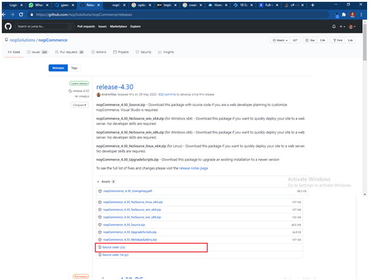

<!--  -->
# NopCommerce with Angular 
Hello I am `Sudhakar Verma` , today I am going to create a NopCommerce App With Angular using Visual stdio 2019.
Follow following steps to create angular  app with nopCommerce 

 Follow following steps to create angular  app with nopCommerce 
 ### 1. Running NopCommerce App 
 1.goto nopCommerce github then clone lasted release like as follows
     Open [https://github.com/nopSolutions/nopCommerce/releases](https://github.com/nopSolutions/nopCommerce/releases).  
     
 2.Click on Source Code(zip) file(this will download source code of NopCommerce)
 3.Goto to Location where downloaded NopCommerce  zip file then extact nopCommerce Zip file like this 
         
  
 4.Go to inside extracted folder look like as 
         
         Then open Solution with Visual studio 2019 (by Click on NopCommerce.sln)
         Press `F5` (Run App)
         Now App is Running 
                  
    Fill required info like above I fill then Click Install 
    Now run again now you will able to see running app like this 
          
 ### 2. Creating Angular Client App nopCommerce
   1.Goto inside  Presentation\Nop.Web like as 
        
   2.Now open Git Bash by right click on Mouse in window  
         
    This will open git bash command line interface 

 Run following angular command here(before this please install node and angular Cli in your System more info )
 `Note: Please make sure you have installed node and npm in your system. You can check   your node version and npm version by using the following command: `
    ```node -v```
    ```npm –v```
     like as 
     
**•	Create new project by this command**
    `
    ng new ClientApp –style=scss --routing
    `
         
Now goto inside `ClientApp` using Cd command then run `ng serve` command like this
         
Now Open browser open http://localhost:4200/ 
             
 ### 3.Configure Spa With NopCommerce App
 1.Open Visual studio 2019 then Open Solution Explorer
 2.Open File [RouteProvider.cs](Presentation/Nop.web/Infrastructure/RouteProvider.cs)  
  
Now  comment all code for font end releated like this 
    
    
3.Now open [GenericUrlRouteProvider.cs](Presentation/Nop.web/Infrastructure/GenericUrlRouteProvider.cs) then comment unreleated code code look like this  
    
4.Open Nop.Web->Views->_viewStart.cshtml 
 Comments All code like this    
   
5.Now double on [Nop.Web](Presentation/Nop.Web/Nop.Web.csproj) then change file 
    Insert following line after `<AspNetCoreHostingModel>InProcess</AspNetCoreHostingModel> `this line 

    
```xml
    <TypeScriptCompileBlocked>true</TypeScriptCompileBlocked>
    <TypeScriptToolsVersion>Latest</TypeScriptToolsVersion>
    <SpaRoot>ClientApp\</SpaRoot>
    <DefaultItemExcludes>$(DefaultItemExcludes);$(SpaRoot)node_modules\**</DefaultItemExcludes>
 
    <!-- Set this to true if you enable server-side prerendering -->
    <BuildServerSideRenderer>true</BuildServerSideRenderer>

```
like this 
       
Insert following code 
```xml
    <!-- Don't publish the SPA source files, but do show them in the project files list -->
    <Content Remove="$(SpaRoot)**" />
    <None Include="$(SpaRoot)**" Exclude="$(SpaRoot)node_modules\**" />
    
```

    Before 
 ```xml 
 <Content Include="App_Data\**" CopyToPublishDirectory="PreserveNewest" Exclude="App_Data\*.json" />
 ```
  line 
Like this 
           

Insert following code in last but before `Project` closing tab
```xml
<UsingTask TaskName="ReplaceFileText" TaskFactory="RoslynCodeTaskFactory" AssemblyFile="$(MSBuildToolsPath)\Microsoft.Build.Tasks.Core.dll">
    <ParameterGroup>
      <InputFilename ParameterType="System.String" Required="true" />
      <OutputFilename ParameterType="System.String" Required="true" />
      <MatchExpression ParameterType="System.String" Required="true" />
      <ReplacementText ParameterType="System.String" Required="true" />
    </ParameterGroup>
    <Task>
      <Using Namespace="System" />
      <Using Namespace="System.IO" />
      <Using Namespace="System.Text.RegularExpressions" />
      <Code Type="Fragment" Language="cs">
        <![CDATA[  
          File.WriteAllText(
            OutputFilename,
            Regex.Replace(File.ReadAllText(InputFilename), MatchExpression, ReplacementText)
            );
        ]]>
      </Code>
    </Task>
  </UsingTask>
  
  <Target Name="EnsureNodeEnv" BeforeTargets="ResolveTagHelperRazorGenerateInputs" Condition="!Exists('$(SpaRoot)node_modules') ">
    <!-- Ensure Node.js is installed -->
    <Exec Command="node --version" ContinueOnError="true">
      <Output TaskParameter="ExitCode" PropertyName="ErrorCode" />
    </Exec>
    <Error Condition="'$(ErrorCode)' != '0'" Text="Node.js is required to build and run this project. To continue, please install Node.js from https://nodejs.org/, and then restart your command prompt or IDE." />
    <Message Importance="high" Text="Restoring dependencies using 'npm'. This may take several minutes..." />
    <Exec WorkingDirectory="$(SpaRoot)" Command="npm install" />
  </Target>
  
  <PropertyGroup Condition="'$(Configuration)' == 'Debug'">
    <FontendBuildCommand>npm run build</FontendBuildCommand>
    <FontendBuildSSRCommand>npm run build</FontendBuildSSRCommand>
    <FontendRunCommand>npm start</FontendRunCommand>
  </PropertyGroup>
  
  <PropertyGroup Condition="'$(Configuration)' == 'Release'">
    <FontendBuildCommand>npm run build:production</FontendBuildCommand>
    <FontendBuildSSRCommand>npm run build:ssr:production</FontendBuildSSRCommand>
  </PropertyGroup>
  
  <Target Name="BuildFrontEnd" DependsOnTargets="EnsureNodeEnv" AfterTargets="EnsureNodeEnv" Condition=" !Exists('$(SpaRoot)dist')">
    <Message Importance="high" Text="Cleaning angular build...." />
    <ItemGroup>
      <FilesToDelete Include="$(SpaRoot)dist\**; wwwroot\dist\**" />
    </ItemGroup>
    <Delete Files="@(FilesToDelete)" />
    <RemoveDir Directories="ClientApp\dist; wwwroot\dist" />
    <Message Importance="high" Text="Building the client side angular App...." />
    <Exec WorkingDirectory="$(SpaRoot)" Command="$(FontendBuildCommand)" />
    <Message Importance="high" Text="Building the server side rendered angular App...." Condition=" '$(BuildServerSideRenderer)' == 'true' " />
    <Exec WorkingDirectory="$(SpaRoot)" Command="$(FontendBuildSSRCommand)" Condition=" '$(BuildServerSideRenderer)' == 'true' " />
    <Exec Command="robocopy  wwwroot\dist\ wwwroot\dist\en-in\" IgnoreExitCode="true" />
    <!--<ReplaceFileText InputFilename="wwwroot\dist\index.html" OutputFilename="Views\Home\Index.cshtml" MatchExpression="&lt;app-root&gt;Loading...&lt;\/app-root&gt;" ReplacementText=" " />-->
  </Target>

  <Target Name="PublishRunWebpack" AfterTargets="ComputeFilesToPublish">
    <!-- Include the newly-built files in the publish output -->
    <ItemGroup>
      <DistFiles Include="$(SpaRoot)dist\**;" />
      <DistFiles Include="$(SpaRoot)node_modules\**" Condition="'$(PublishNodeModules)' == 'true'" />
      <SpaDistFiles Include="wwwroot\dist\**" />
      <ResolvedFileToPublish Include="@(DistFiles->'%(FullPath)')" Exclude="@(ResolvedFileToPublish)">
        <RelativePath>%(DistFiles.Identity)</RelativePath>
        <CopyToPublishDirectory>PreserveNewest</CopyToPublishDirectory>
      </ResolvedFileToPublish>
      <ResolvedFileToPublish Include="@(SpaDistFiles->'%(FullPath)')" Exclude="@(ResolvedFileToPublish)">
        <RelativePath>%(SpaDistFiles.Identity)</RelativePath>
        <CopyToPublishDirectory>PreserveNewest</CopyToPublishDirectory>
      </ResolvedFileToPublish>
    </ItemGroup>
  </Target>

```
 
Like  as 
    

Now save nop.web (press Control + S)

6.Now open Nop.Web->ClientApp->[angular.json](Presentation/Nop.Web/ClientApp/angular.json) 
file like as
     
Now change [projects->architect->options->outputPath to ../wwwroot/dist]()
Like this  
         
7.Now go Open Nop.web->Views->Home->[index.cshtml](Presentation/Nop.Web/Views/Home/index.cshtml)
         
         Replace all [index.cshtml](Presentation/Nop.Web/Views/Home/index.cshtml) code with following line 
```html        
<!doctype html>
<html lang="en">
<head>
<meta charset="utf-8">
<title>ClientApp</title>
<base href="/">
<meta name="viewport" content="width=device-width, initial-scale=1">
<link rel="icon" type="image/x-icon" href="favicon.ico">
<link rel="stylesheet" href="~/dist/styles.css"></head>
<body>
<app-root></app-root>
<script src="~/dist/runtime.js" defer></script>
<script src="~/dist/polyfills.js" defer></script>
<script src="~/dist/vendor.js" defer></script>
<script src="~/dist/main.js" defer></script>
</body>
</html>
```
8.Now run your project Pressing F5 
9.now app running successfully like this 
         
